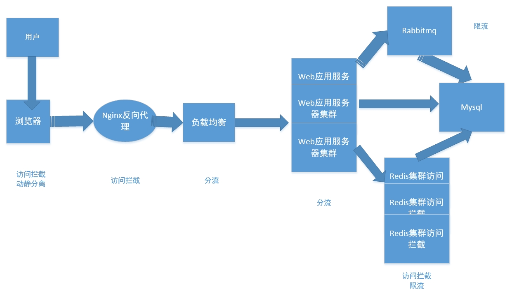
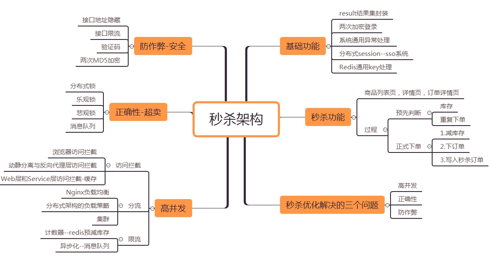
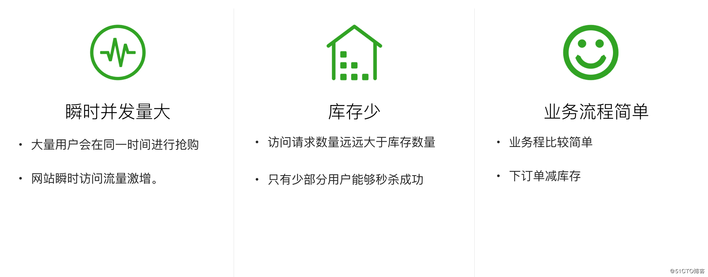
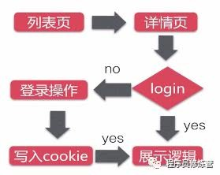
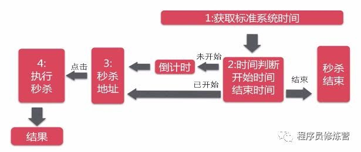
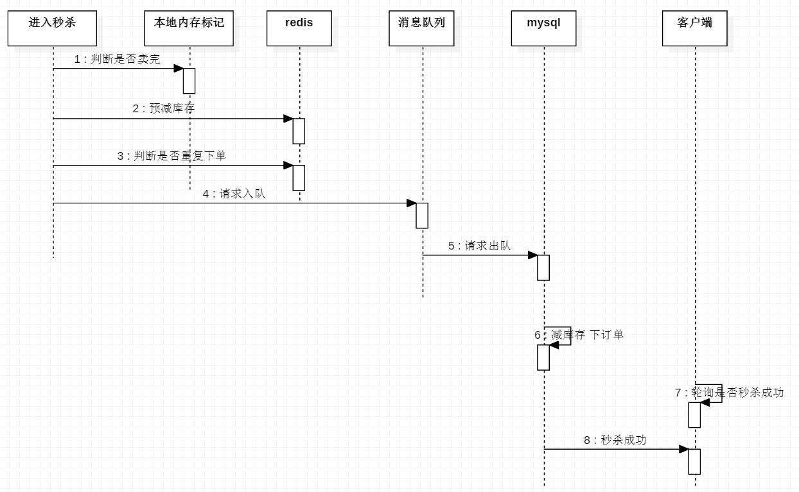
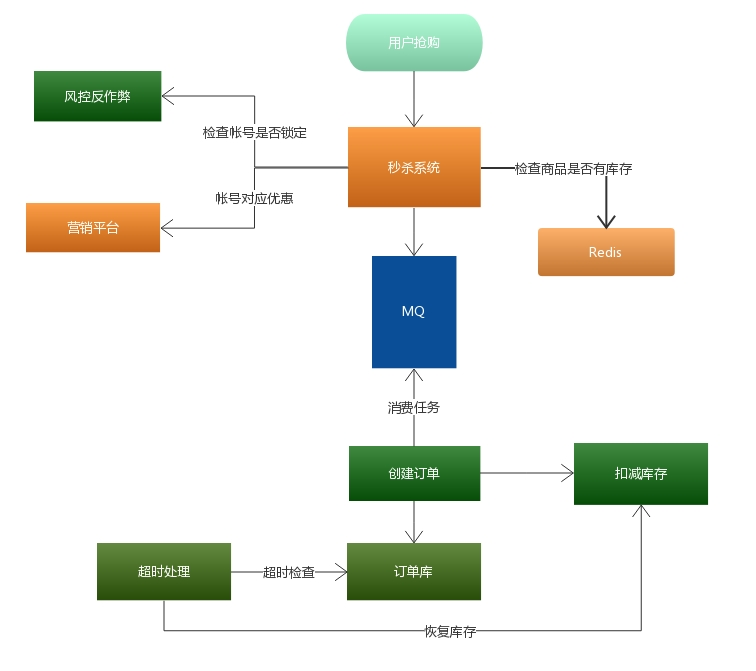

# Table of Contents

- [架构](#架构)
- [秒杀业务分析](#秒杀业务分析)
  - [业务特点](#业务特点)
  - [性能瓶颈](#性能瓶颈)
    - [数据库锁竞争](#数据库锁竞争)
    - [秒杀读多写少的特性](#秒杀读多写少的特性)
  - [技术难点](#技术难点)
  - [秒杀流程](#秒杀流程)
  - [数据库表设计](#数据库表设计)
- [重要基础功能开发](#重要基础功能开发)
  - [result结果集封装](#result结果集封装)
  - [redis通用缓存Key封装](#redis通用缓存key封装)
  - [明文密码两次MD5处理](#明文密码两次md5处理)
    - [第一次的目的](#第一次的目的)
    - [第二次的目的](#第二次的目的)
  - [全局异常处理器](#全局异常处理器)
    - [异常抛出的流程](#异常抛出的流程)
    - [全局异常处理器处理思路：](#全局异常处理器处理思路)
    - [实现](#实现)
  - [分布式Session--SSO系统](#分布式session--sso系统)
- [秒杀系统优化](#秒杀系统优化)
  - [高并发-访问拦截](#高并发-访问拦截)
    - [动静分离与反向代理层访问拦截](#动静分离与反向代理层访问拦截)
    - [Web层和Service层访问拦截](#web层和service层访问拦截)
  - [高并发-分流](#高并发-分流)
  - [高并发-限流](#高并发-限流)
    - [计数器--redis预减库存](#计数器--redis预减库存)
    - [异步化--消息队列](#异步化--消息队列)
    - [数学公式验证码](#数学公式验证码)
  - [正确性-超卖问题](#正确性-超卖问题)
    - [原因](#原因)
    - [解决重复下单](#解决重复下单)
  - [防作弊--安全性](#防作弊--安全性)
    - [秒杀接口地址隐藏](#秒杀接口地址隐藏)
    - [限流](#限流)
  - [其它优化](#其它优化)
    - [先下单再减库存](#先下单再减库存)
- [网站设计概述](#网站设计概述)
- [参考资料](#参考资料)

# 架构





# 秒杀业务分析

1. 正常电子商务流程（1）查询商品；（2）创建订单；（3）扣减库存；（4）更新订单；（5）付款；（6）卖家发货
2. 秒杀业务的特性（1）低廉价格；（2）大幅推广；（3）瞬时售空；（4）一般是定时上架；（5）时间短、瞬时并发量高；

## 业务特点



## 性能瓶颈

### 数据库锁竞争

I：　首先MySQL自身对于高并发的处理性能就会出现问题，一般来说，**MySQL的处理性能会随着并发thread上升而上升，但是到了一定的并发度之后会出现明显的拐点**，之后一路下降，最终甚至会比单thread的性能还要差。

II： 其次，超卖的根结在于减库存操作是一个事务操作，需要先select，然后insert，最后update -1。最后这个-1操作


是不能出现负数的，但是当多用户在有库存的情况下并发操作，出现负数这是无法避免的。

III：最后，当减库存和高并发碰到一起的时候，由于操作的库存数目在同一行，就会出现争抢**InnoDB行锁**的问题，导致出现互相等待甚至死锁，从而大大降低MySQL的处理性能，最终导致前端页面出现超时异常。

- Mysql执行单条的SQL语句其实是非常快的
- 主要是**行级锁事务的等待**，网络的延迟和GC回收！

update number set x=x-1 where (x -1 ) >= 0;

这个语句在innodb，设置了事务和RR可重复读隔离级别下，并且使用到了索引，是会加上行锁（X锁）的，可以直接解决超卖问题，但是高并发扛不住，行锁竞争严重。所以使用消息队列，做一个缓冲，减轻mysql行锁竞争的压力。

消息队列的作用：1. 减轻mysql行锁的竞争 2. 异步下单

### 秒杀读多写少的特性

使用缓存


## 技术难点

秒杀系统主要解决三大问题：

​    一、**瞬时的高并发访问**。抢购和普通的电商销售有所不同，普通的电商销售，流量是比较平均的，虽然有波峰波谷，但不会特别突出。而抢购是在特定时间点进行的推销活动，抢购开始前，用户不断刷新页面，以获得购买按钮；抢购开始的一瞬间，集中并发购买。

​    二、**数据正确性**。抢购毕竟是一种购买行为，需要购买、扣减库存、支付等复杂的流程，在此过程中，要保证数据的正确性，防止超卖（卖出量超过库存）的发生。

​    三、**防作弊**。无论是火车票的购买，还是低价商品的促销，肯定不希望某些客户买到所有的商品，应尽量保证公平性。通过购票插件购买火车票，阿里巴巴抢月饼事件等，需要限制技术性用户绕过网站的限制，通过技术手段获得不良收益。

​    解决上述问题，主要有如下的三个思路：**访问拦截，分流，限流**。

​    主流的Web站点采用分层的架构设计，如果你的应用还没有采用分层的架构，那么先做分层设计吧。一般来说，浏览器采用了html/js/css技术，负责数据的展示；反向代理一般采用nginx，负责负载均衡；Web层是指Php，Tomcat等应用服务器，负责用户状态的维护，http协议处理等；service层一般是rpc调用，当然也有用http的，例如spring cloud；数据库存储一般是mongodb，mysql等持久化数据方案。用户的一次数据访问，例如查询商品库存，数据是从上层依次调用到DB，逐层返回数据。

## 秒杀流程 

登录



准备进入秒杀



开始秒杀



整体流程



## 数据库表设计

商品表	秒杀商品表
订单表	秒杀订单表

如果直接在商品表里面添加一个字段表明是否是秒杀商品，会让商品表难以维护

# 重要基础功能开发

## result结果集封装

暴露接口，而不是直接去创建对象，面向接口编程，进行解耦合

由于错误有多种原因，所以使用CodeMsg封装code，msg

```java
return Result.success("hello");
return new Result<String>(50010,"success","hello"); //耦合度太高，硬编码
```

```java
public class Result<T> {
	private int code;
	private String msg;
	private T data;
	//construtor
	public static <T> Result<T> success(T data) {
		return new Result<T>(data);
	}
	public static <T> Result<T> error(CodeMsg cm) {
		return new Result<T>(cm);
	}
	//get-set
}
```

```java
public class CodeMsg {
	private int code;
	private String msg;
    //construtor
	public static CodeMsg SUCCESS=new CodeMsg(0,"success");
	public static CodeMsg SERVER_ERROR=new CodeMsg(500100,"服务端异常");
    //get-set
}
```

## redis通用缓存Key封装

[电商系统，Redis做缓存时===>通用缓存key的封装](https://blog.csdn.net/tiankong_12345/article/details/86651613)

采用**字符串**的数据类型，但是不同模块的key可能会相互影响，所以应该设计这样的key "UserKey:id1"，"OrderKey:id1"

**模板模式：接口+抽象类+具体实现**

**优点**

具体细节步骤实现定义在子类中，子类定义详细处理算法是不会改变算法整体结构
**代码复用**的基本技术，在数据库设计中尤为重要
存在一种反向的控制结构，通过一个父类调用其子类的操作，通过子类对父类进行扩展增加新的行为，符合“**开闭原则**”

**缺点**　

每个不同的实现都需要定义一个子类，会导致类的个数增加，系统更加庞大

接口

```java
public interface KeyPrefix {
	public int expireSeconds() ;
	public String getPrefix() ;
}
```

**抽象类**

```java
public abstract class BasePrefix implements KeyPrefix{
	private int expireSeconds;
	private String prefix;
	public BasePrefix(int expireSeconds,String prefix) {
		this.expireSeconds=expireSeconds;
		this.prefix=prefix;
	}
	public BasePrefix(String prefix) {
		this(0, prefix);
	}
	public int expireSeconds() {
		return expireSeconds;
	}
    //具体的方法，也就是模板，不管什么样的key都是通过这种模式进行拼接
	public String getPrefix() {
		String className=getClass().getSimpleName();
		return className+":"+prefix;
	}
}
```

**具体实现类**

```java
public class UserKey extends BasePrefix{
    //子类实现的具体方法，传入不同的属性
	private UserKey(String prefix) {
		super(prefix);
	}
	public static UserKey getById=new UserKey("id");
	public static UserKey getByName=new UserKey("name");
}
```

**service**

```java
public <T> T get(KeyPrefix keyPrefix,String key,Class<T> clazz) {
    Jedis jedis=null;  
    try {
        jedis=jedisPool.getResource();
        //生成真正的key
        String realKey=keyPrefix.getPrefix()+key;
        String string=jedis.get(realKey);
        T t=stringtoBean(string,clazz);
        return t;
    } finally {
        returnToPool(jedis);
    }
}
```

**controller**

```java
@RequestMapping("/redis/get")
@ResponseBody
public Result<User> redisGet(){
    User v1=redisService.get(UserKey.getById,""+1,User.class);
    return Result.success(v1);
}
```

## 明文密码两次MD5处理

[两次MD5加密设计](<https://blog.csdn.net/weixin_38035852/article/details/81052431>)

两次MD5
1.用户端：PASS=MD5（明文+固定Salt）
2.服务端：PASS=MD5（用户输入+随机Salt）

### 第一次的目的

第一次 （在前端加密，客户端）：密码加密是（明文密码+固定盐值）生成md5用于传输，目的，由于http是明文传输，当输入密码若直接发送服务端验证，此时被截取将直接获取到明文密码，获取用户信息。

加盐值是为了混淆密码，原则就是明文密码不能在网络上传输。

### 第二次的目的

第二次：在服务端再次加密，当获取到前端发送来的密码后。通过MD5（密码+随机盐值）再次生成密码后存入数据库。防止数据库被盗的情况下，通过md5反查，查获用户密码。方法是盐值会在用户登陆的时候随机生成，并存在数据库中，这个时候就会获取到。

第二次的目的：
黑客若是同时黑掉数据库，通过解析前端js文件，知道如果md5加密的过程，就知道此时用户的密码。但是此时我们要是在后端加入随机盐值和传输密码的md5组合，黑客是无法知道通过后端密码加密过程的，从而无法知道密码。

## 全局异常处理器

[springBoot配置全局异常处理器](<https://blog.csdn.net/Lei_Da_Gou/article/details/80481846>)

[WEB 项目中的全局异常处理](https://www.cnblogs.com/lhblogs/p/7489246.html)

### 异常抛出的流程

　　在web 项目中，遇到异常一般有两种处理方式：try.....catch....；throw

　　通常情况下我们用try.....catch.... 对异常进行捕捉处理，可是在实际项目中随时的进行异常捕捉，会造成代码重复和繁杂，我们希望代码中只有业务相关的操作，所有的异常我们单独设立一个类来处理它。

​		首先，我们在可能发生异常的方法，全部throw出来，**即dao抛给service、service给controller、controller抛给前端控制器；然后由前端控制器调用 全局异常处理器  对异常进行统一处理**

### 全局异常处理器处理思路：

　　　　首先解析出异常类型；

　　　　　　如果该 异常类型是系统 自定义的异常，直接取出异常信息，在错误页面展示

　　　　　　如果该 异常类型不是系统 自定义的异常，构造一个自定义的异常类型（信息为“未知错误”）（应为一般业务异常我们并不希望被用户知道，防止代码泄露，造成不安全）

　　　　　　自定义异常一般是业务异常，这个异常的信息应该告知客户，系统异常一般是代码异常，一般写日志

### 实现

**定义全局异常类，继承RuntimeException，包装CodeMsg，然后全局异常处理器会捕获全局异常，捕获异常之后给客户端返回一个result，这个result包装了错误信息**

**自定义的全局异常类**

```java
public class GlobalException extends RuntimeException{
	private static final long serialVersionUID = 1L;
	private CodeMsg cm;
	public GlobalException(CodeMsg cm) {
		super(cm.toString());
		this.cm = cm;
    }
	public CodeMsg getCm() {
		return cm;
	}
}
```

**全局异常处理器**

类似controller，拦截Exception类型的异常，并给前端返回Result

使用@ControllerAdvice，@ExceptionHandler

```java
@ControllerAdvice
@ResponseBody
public class GlobalExceptionHandler {
	@ExceptionHandler(value=Exception.class)
	public Result<String> exceptionHandler(HttpServletRequest request, Exception e){
		e.printStackTrace();
		if(e instanceof GlobalException) {
			GlobalException ex = (GlobalException)e;
			return Result.error(ex.getCm());
		}else if(e instanceof BindException) {
			BindException ex = (BindException)e;
			List<ObjectError> errors = ex.getAllErrors();
			ObjectError error = errors.get(0);
			String msg = error.getDefaultMessage();
			return Result.error(CodeMsg.BIND_ERROR.fillArgs(msg));
		}else {
			return Result.error(CodeMsg.SERVER_ERROR);
		}
	}
}
```

## 分布式Session--SSO系统

[基于Redis实现分布式Session](<https://blog.csdn.net/fanrenxiang/article/details/81738634>)

使用Redis作为session存储容器，登录时将session信息存储至cookie客户端，同时服务端将session信息存至redis缓存，双重保障，接下来的接口调用直接可以获取到cookie中的token信息作为参数传递进来即可，如果发现token为空，则再从redis中获取，如果两者都为空，则说明session已过期。

```java
private static String redisKey = "user:session";
//登录成功后生成并保存token
public boolean login(HttpServletResponse response, User user) {
    // 验证用户身份
    User user = userService.check(……);
    //  salt值建议做成可配置化
    String salt = "";
    String token = DigestUtils.md5Hex(user.getName() + salt);   //这里token作为用户信息唯一标识
    addCookie(response, token);
    return true;
}

//添加至redis和cookie
private void addCookie(HttpServletResponse response, String token) {
    redisTemplate.opsForValue().set(redisKey, token, 366, TimeUnit.DAYS);//放入缓存
    Cookie cookie = new Cookie("token", token);
    cookie.setMaxAge(3600 * 24 * 366);   //和Redis缓存失效时间一致
    cookie.setPath("/");
    response.addCookie(cookie);
}

//获取已登录的用户信息
public String getByToken(HttpServletResponse response) {
    String userinfo = redisTemplate.opsForValue().get(redisKey);
    //延长session有效期，过期时间=最后一次使用+失效时间，cookie可以不延长
    if (StringUtils.isNotEmpty(userinfo)) {
        addCookie(response, userinfo);
    }
    return userinfo;
}
```

# 秒杀系统优化

秒杀系统主要解决三大问题：

​    一、**瞬时的高并发访问**。抢购和普通的电商销售有所不同，普通的电商销售，流量是比较平均的，虽然有波峰波谷，但不会特别突出。而抢购是在特定时间点进行的推销活动，抢购开始前，用户不断刷新页面，以获得购买按钮；抢购开始的一瞬间，集中并发购买。

​    二、**数据正确性**。抢购毕竟是一种购买行为，需要购买、扣减库存、支付等复杂的流程，在此过程中，要保证数据的正确性，防止超卖（卖出量超过库存）的发生。

​    三、**防作弊**。无论是火车票的购买，还是低价商品的促销，肯定不希望某些客户买到所有的商品，应尽量保证公平性。通过购票插件购买火车票，阿里巴巴抢月饼事件等，需要限制技术性用户绕过网站的限制，通过技术手段获得不良收益。

​    解决上述问题，主要有如下的三个思路：**访问拦截，分流，限流**。

## 高并发-访问拦截

​    **所谓访问拦截，是指尽量把访问拦截在上层，减轻下一层的压力，即离用户访问更近的那一层**。下面将从每一层讲解如何做访问拦截。


### 动静分离与反向代理层访问拦截

动态页面是指根据实时数据渲染的，需要组织数据、渲染页面；静态页面是存储在文件系统的文件，不会根据数据变化而变化，读取速度很快。为了提升效率，应尽可能的静态化，用静态页面，替换动态页面。例如，商品信息页，商品信息在发布后，是不会变化的，如果采用动态的方式，访问数据库读取数据，service组装数据，web渲染数据；如果发布商品信息时，就保存下商品信息的静态页面，访问时只需要读取一个文件就够了。

做了动静分离，静态文件的访问应在哪一层返回？无论是tomcat，还是apache，都支持静态文件的访问，很多时候我们也是这么做的，把静态文件作为web项目的一部分进行发布。Nginx也支持静态文件的访问，更高效的做法是，把静态文件交由nginx管理，访问nginx直接返回静态数据，减轻Web服务的压力。

### Web层和Service层访问拦截

通过上述的访问拦截，进入到web层的，都是动态数据访问。这部分的访问拦截，**主要采用缓存的策略**，减少对下一层的数据访问。缓存又可分为本地缓存和redis、memcache等缓存中间件。关于缓存，重点关注缓存的淘汰策略。一般有三种方式：超时更新，定时更新，通知更新。

1、对象缓存：用户信息缓存

2、本地缓存：当库存小于0时，本地使用一个map做内存标记，key为商品ID，value为true，代表商品已经卖完，无需进行后面的秒杀流程。

访问拦截，除了减少向下一层的访问，还大幅提高系统的支持用户数。访问拦截，大大减少了每次请求的处理时间，假设：每个请求原来需要200ms时间，10W的并发量，每秒钟可处理50W的请求；通过访问拦截，每个请求的处理时间下降到100ms，同样的并发量，每秒钟可处理100W的请求。

通过上述的分析，各层通过访问拦截，系统架构演变成如下的结构。


## 高并发-分流


## 高并发-限流

​    访问拦截和分流的策略，主要作用还是解决并发读的问题。购买、支付等这类“写请求”，不能像读缓存一样，写缓存提高效率，数据持久化成功，才算交易成功。尤其抢购这种模式下，商品数量少，如果多台服务同事写数据，将造成mysql严重的行锁冲突，执行效率远远不如顺序执行。并且大量的所等待，延长单个操作的时长，占用工作线程，产生服务雪崩现象，短时间内不能对外提供服务。**解决此问题的思路是限流，限制写操作的流量，使其正常运行，不影响业务。**

### 计数器--redis预减库存

通过redis预减库存，如果库存小于0，则不同访问数据库

还可以阻挡多余的请求透穿到DB，起到一个保护的作用，因为秒杀的商品有限，比如10个，让1万个请求区访问DB是	没有意义的，因为最多也就只能10个请求下单成功。

**缓存和数据库的一致性：redis 预减成功，DB扣减库存失败怎么办**

1、可以将redis的库存设置的比实际值大

2、需要使用分布式事务，使用TCC补偿事务的方式，try阶段预减库存，comfirm阶段下单，cancle阶段增加库存

如果不使用分布式事务进行回滚，则会出现商品库存减掉了，但是没有订单生成

**为什么redis数量会减少为负数**

```java
long stock = redisService.decr(GoodsKey.getMiaoshaGoodsStock,""+goodsId) ;
if(stock <0){
    localOverMap.put(goodsId, true);
    return Result.error(CodeMsg.MIAO_SHA_OVER);
}
//假如redis的数量为1,这个时候同时过来100个请求，大家一起执行decr数量就会减少成-99这个是正常的,进行优化后改变了sql写法和内存写法则不会出现上述问题
```

### 异步化--消息队列

是指把购买请求的接受和处理异步化。购买请求先放到队列中，这个过程非常高效，返回客户信息。抢购服务订阅消息队列，异步处理购买请求，处理成功给用户发消息。异步化主要解决成产和消费的速度不匹配问题，由此类场景都可以采用。


### 数学公式验证码

描述：点击秒杀前，先让用户输入数学公式验证码，验证正确才能进行秒杀。

好处：

1）防止恶意的机器人和爬虫

2）分散用户的请求

实现：

1）前端通过把商品id作为参数调用服务端创建验证码接口

2）服务端根据前端传过来的商品id和用户id生成验证码，并将商品id+用户id作为key，生成的验证码作为value存入redis，同时将生成的验证码输入图片写入imageIO让前端展示。

3）将用户输入的验证码与根据商品id+用户id从redis查询到的验证码对比，相同就返回验证成功，进入秒杀；不同或从redis查询的验证码为空都返回验证失败，刷新验证码重试

## 正确性-超卖问题

[超卖现象及解决](<https://blog.csdn.net/weixin_38035852/article/details/81174802>)

[用分布式锁来防止库存超卖，但是是每秒上千订单的高并发场景，如何对分布式锁进行高并发优化来应对这个场景？](<https://blog.csdn.net/u010391342/article/details/84372342>)

### 原因

先Select 剩余量 from 表，再update为什么有问题

select是共享锁，update是排它锁，共享锁不能解决并发问题，会使得在库存为1的时候，多个线程同时判断出库存大于0，多个线程都进程update操作，导致库存为负数。

1. ```
   update miaosha_goods set stock_count = stock_count - 1 where goods_id = #{goodsId}
   ```

### 解决

**1. 悲观锁：性能差**

```sql
update number set x=x-1 where x>0
```

在update语句后面增加x>0的判断

这个语句在innodb，使用到了索引，是会加上**行锁（X锁）**的，可以直接解决超卖问题，但是高并发扛不住，行锁竞争严重。

**2. 消息队列**

使用消息队列做**异步化**，前端轮询秒杀结果。请求先进入队列，做一个**肖峰**作用，避免mysql直接面多高并发。

如果是使用单个消费者，则mysql不用做处理，就可以直接避免超卖现象，因为将单个消费者将并行操作变成了串行操作。

如果使用多个消费者，那就必须使用悲观锁或者乐观锁的方式来避免超卖现象。


**3. 乐观锁：冲突检测，cpu消耗大**

```sql
update t_goods set status=2,version=version+1 where id=#{id} and version=#{version};
```

不过，它会增大CPU的计算开销，在秒杀的这个场景下，更新库存的效率是比较高的，所以这里使用乐观锁是一个不错的方式。

**4. 分布式锁**

[Redis分布式锁实现秒杀业务(乐观锁、悲观锁)](https://www.cnblogs.com/jasonZh/p/9522772.html)

锁优化：将库存进行分段，使用分段锁，当段内库存不足，自动释放锁，切换到下一个库存分段中。

**5. 程序锁**

[切面秒杀锁Lock](https://www.jianshu.com/p/180e46d691b3)

使用AOP实现程序锁


**消息队列**

将多线程变为单线程读写，但是高并发的场景下，因为请求很多，很可能一瞬间将队列内存“撑爆”，然后系统又陷入到了异常状态。或者设计一个极大的内存队列，也是一种方案，但是，系统处理完一个队列内请求的速度根本无法和疯狂涌入队列中的数目相比。也就是说，队列内的请求会越积累越多，最终Web系统平均响应时候还是会大幅下降，系统还是陷入异常。

### 解决重复下单

将userId和商品Id 加上唯一索引，可以解决这种情况。插入失败。

## 防作弊--安全性

   [接口地址隐藏](<https://blog.csdn.net/ldb987/article/details/86743312>)

### 秒杀接口地址隐藏

思路：秒杀开始之前，先去请求接口获取秒杀地址

1.接口改造，带上PathVariable参数
2.添加生成地址的接口
3.秒杀收到请求，先验证PathVariable

如果用户提前知道了接口地址，就可能出现狂刷接口的现象，为了防止这种情况发生，最好的方法就是不让用户获取到秒杀接口地址。有一种实现方式就是隐藏接口地址，所谓的隐藏是指，秒杀地址每次都是不同的，而且在地点秒杀按钮后，会先调用后端接口获取一个pathId，然后传回前端，拼接在秒杀接口上，再请求秒杀接口地址，这样每次点击按钮后，才会生成真正的秒杀接口地址。

好处：可以防止接口泄露，或者用户提前知道接口，而出现的狂刷接口的现象。

实现：
1、点击秒杀按钮，先请求一个后端服务，生成随机数(进行MD5加密)作为pathId，存入缓冲，设置过期时间，然后传回前端。

```javascript
// 调用后台接口获取秒杀接口的入口地址
function getMiaoshaPath(){
	var goodsId = ("#goodsId").val();
	g_showLoading();
	.ajax({
		url:"/miaosha/path",
		type:"GET",
		data:{
			goodsId:goodsId,
			verifyCode:$("#verifyCode").val()
		},
		success:function(data){
			if(data.code == 0){
                //相当于是产生的uuid（获取到的秒杀接口的入口地址）
				var path = data.data;
				doMiaosha(path);
			}else{
				layer.msg(data.msg);
			}
		},
		error:function(){
			layer.msg("客户端请求有误");
		}
	});
}
```

后端方法

```java
@RequestMapping(value="/path", method=RequestMethod.GET)
    @ResponseBody
    public Result<String> getMiaoshaPath(HttpServletRequest request, MiaoshaUser user,
    		@RequestParam("goodsId")long goodsId,
    		@RequestParam(value="verifyCode", defaultValue="0")int verifyCode
    		) {
    	if(user == null) {
    		return Result.error(CodeMsg.SESSION_ERROR);
    	}
    	String str = MD5Util.md5(UUIDUtil.uuid()+"123456");
    	redisService.set(MiaoshaKey.getMiaoshaPath, ""+user.getId() + "_"+ goodsId, str);
    	return Result.success(str);
    }
```

2、获得pathId后，前端用这个pathId拼接在秒杀接口上作为参数。

//秒杀的时候，需要向服务端传递参数

```javascript
function doMiaosha(path){
	$.ajax({
        //进行秒杀
		url:"/miaosha/"+path+"/do_miaosha",
		type:"POST",
		data:{
			goodsId:$("#goodsId").val()
		},
		success:function(data){
			if(data.code == 0){
				//window.location.href="/order_detail.htm?orderId="+data.data.id;
				getMiaoshaResult($("#goodsId").val());
			}else{
				layer.msg(data.msg);
			}
		},
		error:function(){
			layer.msg("客户端请求有误");
		}
	});
}
```

3、后端接收到这个pathId，并且与缓冲的pathId比较，如果

```java
@RequestMapping(value="/{path}/do_miaosha", method=RequestMethod.POST)
@ResponseBody
public Result<Integer> miaosha(Model model,MiaoshaUser user,
                               @RequestParam("goodsId")long goodsId,
                               @PathVariable("path") String path) {
    model.addAttribute("user", user);
    if(user == null) {
        return Result.error(CodeMsg.SESSION_ERROR);
    }
    //验证path------------------------------------------
    String pathOld = redisService.get(MiaoshaKey.getMiaoshaPath, ""+user.getId() + "_"+ goodsId, String.class);
    //如果通过比较，进行秒杀逻辑
    if(!path.equals(pathOld)){
        //如果通不过，抛出业务异常，非法请求
        return Result.error(CodeMsg.REQUEST_ILLEGAL);
    }
    //验证path------------------------------------------
    //内存标记，减少redis访问
    boolean over = localOverMap.get(goodsId);
    if(over) {
        return Result.error(CodeMsg.MIAO_SHA_OVER);
    }
    //预减库存
    long stock = redisService.decr(GoodsKey.getMiaoshaGoodsStock, ""+goodsId);//10
    if(stock < 0) {
        localOverMap.put(goodsId, true);
        return Result.error(CodeMsg.MIAO_SHA_OVER);
    }
    //判断是否已经秒杀到了
    MiaoshaOrder order = orderService.getMiaoshaOrderByUserIdGoodsId(user.getId(), goodsId);
    if(order != null) {
        return Result.error(CodeMsg.REPEATE_MIAOSHA);
    }
    //入队
    MiaoshaMessage mm = new MiaoshaMessage();
    mm.setUser(user);
    mm.setGoodsId(goodsId);
    sender.sendMiaoshaMessage(mm);
    return Result.success(0);//排队中
}

```

### 限流

1、redis

[Redis实现限流功能](https://www.cnblogs.com/use-D/p/9544903.html)

key为URL+userId，值为访问的次数，存活时间为限流规定的时间


2、滑动时间窗口

[微服务接口限流的设计与思考](https://www.infoq.cn/article/microservice-interface-rate-limit)

## 其它优化

### 先下单再减库存

实际上两者都可以。但是，在我的小项目上，使用的是后者。为什么？很重要的一点是可以减少网络传输等延迟。先减库存，当一个线程锁住了行级锁，那么其他线程都需要等待，返回update操作结果后，如果成功，这个线程开始insert操作。每个线程都需要这样的操作。当我先插入秒杀明细的时候，这个时候由于是insert操作，可以并发执行，所以这样减少来一部分的网络延迟，最后才是减库存。

# 网站设计概述


# 参考资料

[秒杀系统架构分析与实战](https://www.cnblogs.com/andy-zhou/p/5364136.html)

[秒杀系统视频笔记](https://blog.csdn.net/qq_41305266?t=1)

[秒杀抢购系统优化思路详解](https://www.jianshu.com/p/b5807229ac5c)

[**阿里云服务器 如何处理网站高并发流量问题？（含教程）**](https://yq.aliyun.com/articles/696140)

[如何解决秒杀的性能问题和超卖的讨论](https://www.cnblogs.com/billyxp/p/3701124.html)

[如何解决高并发，秒杀问题](https://blog.csdn.net/qq_34802511/article/details/81296097)

[切面秒杀锁Lock](https://www.jianshu.com/p/180e46d691b3)

[Java高并发秒杀系统【观后总结】](https://cloud.tencent.com/developer/article/1062954)

[为什么 mysql 这样会出现超卖的问题](
